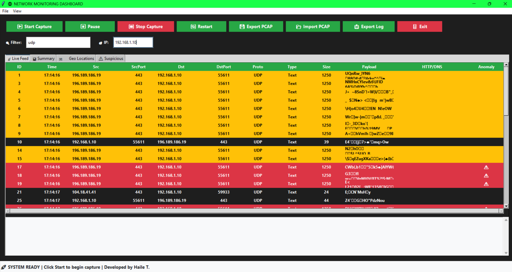
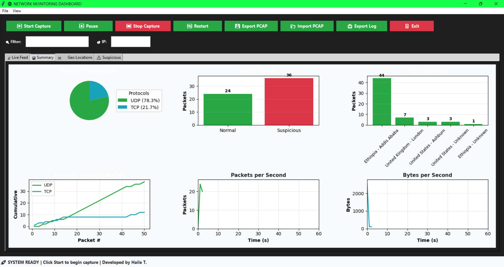
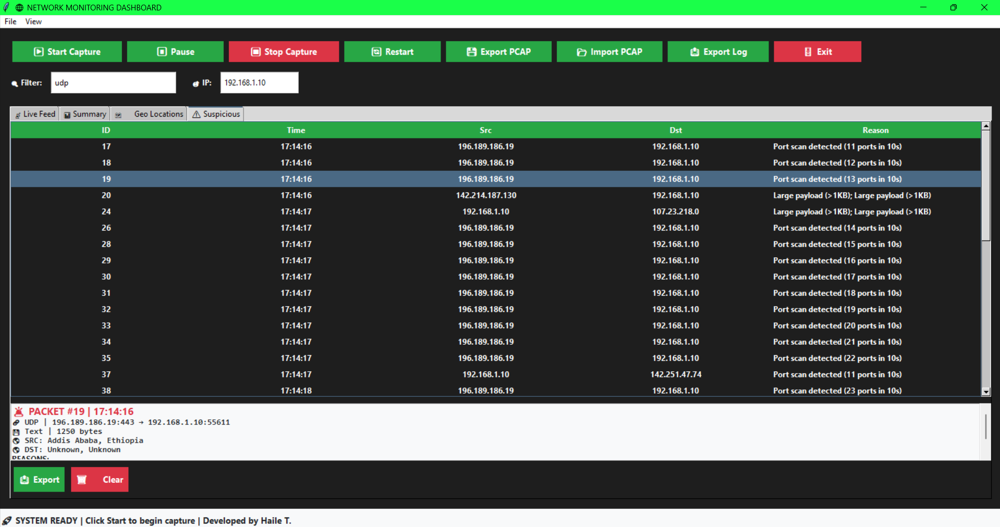

# 🌐 NETWORK MONITORING DASHBOARD

## Professional Documentation

📋 **TABLE OF CONTENTS**
- [Project Overview](#project-overview)
- [System Architecture](#system-architecture)
- [Features](#features)
- [Installation Guide](#installation-guide)
- [User Manual](#user-manual)
- [Technical Specifications](#technical-specifications)
- [Troubleshooting](#troubleshooting)
- [License Information](#license-information)

---

## 🎯 PROJECT OVERVIEW

### 1.1 Purpose
The Network Monitoring Dashboard is a professional-grade network analysis tool designed to provide real-time packet capture, analysis, and visualization capabilities. Inspired by Wireshark's interface, this application offers enterprise-level network monitoring with an intuitive user experience.

### 1.2 Key Objectives
- Real-time network packet capture and analysis
- Comprehensive protocol inspection (TCP, UDP, ICMP, HTTP, DNS)
- Geographic IP location tracking and visualization
- Anomaly and suspicious activity detection
- Professional dashboard interface with responsive design
- Cross-platform compatibility with administrator privileges

### 1.3 Target Audience
- Network administrators
- Security professionals
- IT managers
- Network engineering students
- Cybersecurity researchers

---

## 🏗️ SYSTEM ARCHITECTURE

### 2.1 Component Structure
```
Network Monitoring Dashboard/
├── main.py                 # Application entry point
├── gui.py                  # Graphical User Interface (Tkinter)
├── packet_analyzer.py      # Core packet processing engine
├── GeoLite2-City.mmdb      # GeoIP database (MaxMind)
└── requirements.txt        # Python dependencies
```

### 2.2 Technology Stack
- **Frontend:** Tkinter (Python GUI framework)
- **Backend:** Scapy (packet manipulation library)
- **Data Processing:** Python 3.8+
- **Visualization:** Matplotlib (charts and graphs)
- **Geolocation:** GeoIP2 (MaxMind database)
- **Storage:** In-memory packet storage with PCAP export

### 2.3 Data Flow Diagram
```
[Network Interface] → [Scapy Capture] → [Packet Analyzer] → [GUI Display]
                              ↓               ↑
                    [Protocol Analysis]  [Filter Processing]
                              ↓               ↑
                   [GeoIP Lookup]    [Anomaly Detection]
                              ↓               ↑
                    [Data Storage] ← [UI Interaction]
```

---

## ✨ FEATURES

### 3.1 Core Features
#### **📡 Real-time Packet Capture**
- Live network traffic monitoring
- Support for multiple protocols (TCP, UDP, ICMP)
- Continuous packet processing without interruption
- Administrator privilege requirement for packet capture

#### **🔍 Advanced Filtering System**
- Unified filtering for IP, and Protocol
- IP Filtering: Filter by source or destination IP address
- Protocol Filtering: Filter by protocol type (TCP, UDP, ICMP)
- Combined Filters: Multiple filter criteria simultaneously

#### **🌍 GeoIP Location Tracking**
- Geographic location mapping for all IP addresses
- Country, city, and regional identification
- Latitude/longitude coordinates
- Interactive map visualization (text-based representation)

#### **🚨 Anomaly Detection**
- Port Scan Detection: Identifies potential scanning activities
- Suspicious Port Monitoring: Flags known malicious ports
- Large Payload Detection: Alerts on oversized packets
- HTTP/DNS Analysis: Inspects application-layer protocols

#### **📊 Professional Dashboard**
- Live Feed Tab: Real-time packet display with auto-scrolling
- Summary Tab: Statistical charts and protocol distribution
- Geo Locations Tab: Geographic mapping of network traffic
- Suspicious Tab: Dedicated view for flagged activities

### 3.2 User Interface Features

#### **🖱️ Interactive Elements**
- Right-click Context Menu: Packet replay functionality
- Hover Effects: Orange hover states for all buttons
- Auto-scrolling Tables: Live feed maintains position
- Tabbed Interface: Organized feature access

#### **📱 Responsive Design**
- Adapts to various screen resolutions (minimum 1000x600)
- Dynamic font sizing based on window dimensions
- Scrollable content areas for overflow
- Touch-friendly interface elements

### 3.3 Data Management Features
#### **💾 PCAP Integration**
- Export Functionality: Save captured packets to PCAP format
- Import Capability: Load existing PCAP files for analysis
- Cross-compatibility: Supports both .pcap and .pcapng formats

#### **📤 Log Export**
- Comprehensive packet logging in text format
- Detailed suspicious activity reports
- Timestamped session records

#### **🔄 Session Management**
- Start/Stop Controls: Begin and halt packet capture
- Pause/Resume: Temporarily suspend without data loss
- Restart Function: Clear all data and begin fresh session
- Auto-restart: Immediate new capture after restart

---

## 🛠️ INSTALLATION GUIDE

### 4.1 System Requirements
**Minimum Specifications**
- **Operating System:** Windows 10/11, macOS 10.14+, Ubuntu 18.04+
- **Processor:** Intel Core i3 or equivalent
- **RAM:** 4GB minimum (8GB recommended)
- **Storage:** 500MB available space
- **Display:** 1000x600 resolution minimum

**Required Privileges**
- Administrator Access: Mandatory for live packet capture
- Network Interface Permissions: Read access to network adapters

### 4.2 Software Dependencies
**Python Libraries**
```plaintext
scapy>=2.4.5
geoip2>=4.6.0
matplotlib>=3.5.0
tkinter>=8.6
```

### 4.3 Installation Steps
#### Step 1: Python Environment Setup
```bash
# Create virtual environment
python -m venv network_monitor_env

# Activate environment
# Windows:
network_monitor_env\Scripts\activate
# macOS/Linux:
source network_monitor_env/bin/activate
```

#### Step 2: Install Dependencies
```bash
# Install required packages
pip install scapy geoip2 matplotlib tkinter
```

#### Step 3: GeoIP Database Configuration
- Download GeoLite2-City.mmdb from MaxMind or u can use using directly by intgrating API fetching but it needs extra  coding practice 
- Register for a free account at dev.maxmind.com
- Place database file in the application directory

#### Step 4: Application Deployment
```bash
# Clone or download application files
git clone [https://github.com/your-repo/network-monitor.git](https://github.com/Haile-12/advanced_network_sniffer)

# Navigate to project directory
cd packet_sniffer

# Verify file structure
ls -la
# Should contain: main.py, ui.py, packet_handler.py, GeoLite2-City.mmdb
```

#### Step 5: First Run
```bash
# Run with administrator privileges
# Windows (Command Prompt as Administrator):
python main.py

# macOS/Linux (Terminal with sudo):
sudo python main.py
```

### 4.4 Verification Checklist
✅ **Pre-launch Validation**
- Python 3.8+ installed and accessible
- Virtual environment activated
- All dependencies installed successfully
- GeoLite2-City.mmdb present in directory
- Administrator privileges available

✅ **Post-installation Testing**
- Application launches without errors
- GUI displays correctly with proper theming
- Start button initiates packet capture
- Live feed populates with network traffic
- GeoIP data appears for external IPs
- Filters respond to user input

---


## 📖 USER MANUAL

### 5.1 Getting Started
**Initial Setup**
- Launch Application: Double-click main.py or run from terminal
- Grant Permissions: Accept administrator privilege prompt
- Interface Overview: Familiarize with tabbed navigation
- Begin Capture: Click "▶ Start" to initiate monitoring

**Interface Navigation**
- 📡 Live Feed: Real-time packet display
- 📊 Summary: Statistical analysis and charts
- 🗺️ Geo Locations: Geographic mapping
- ⚠️ Suspicious: Flagged activities

### 5.2 Core Functionality
**Packet Capture Operations**
- **Start Capture**: 
  - ▶ Start
  - Ctrl+K
  - Begin real-time packet monitoring

- **Pause Capture**: 
  - ⏸ Pause
  - Temporarily suspend without data loss

- **Stop Capture**: 
  - ⏹ Stop
  - Ctrl+T
  - Halt capture and preserve data

- **Restart Session**: 
  - 🔄 Restart
  - Ctrl+R
  - Clear all data and start fresh

**Filtering System**
- **Single Filter Input**: Enter IP, or Protocol in filter box
- **Apply Filter**: Click  press Enter
- **Filter Types**:
  - IP Address: "192.168.1.1"
  - Protocol: "TCP" or "UDP"

**Data Export Options**
- **Export PCAP**: 
  - 💾 Export PCAP
  - .pcap
  - Save all captured packets

- **Import PCAP**: 
  - 📂 Import PCAP
  - .pcap/.pcapng
  - Load existing packet capture

- **Export Log**: 
  - 📤 Export Log
  - .txt
  - Generate detailed session report

- **Export Suspicious**: 
  - 📤 Export
  - .txt
  - Save flagged packet details

### 5.3 Advanced Features
**Anomaly Detection Settings**
- Port Scan Threshold: 5+ connections in 10 seconds
- Suspicious Ports: 22, 23, 445, 3389, 31337, 4444, 135, 139
- Large Payload Alert: >1KB packet size
- Custom Rules: Modify in packet_analyzer.py

**GeoIP Configuration**
- Database Update: Monthly refresh recommended
- Offline Mode: Functions without internet connectivity
- Accuracy Levels: City-level precision for most locations

**Performance Optimization**
- Memory Management: Automatic cleanup of old packets
- CPU Efficiency: Minimal overhead during capture
- Bandwidth Monitoring: Real-time throughput tracking

### 5.4 Troubleshooting Common Issues
**Administrator Privileges**
- **Problem**: "Permission denied" error on startup
  - **Solution**:
    1. Close application
    2. Right-click application shortcut
    3. Select "Run as Administrator"
    4. Confirm UAC prompt

**Missing GeoIP Database**
- **Problem**: "GeoIP load failed" message
  - **Solution**:
    1. Download GeoLite2-City.mmdb from MaxMind
    2. Place in application directory
    3. Restart application

**No Packets Displayed**
- **Problem**: Live feed remains empty
  - **Solution**:
    1. Verify network activity (ping google.com)
    2. Check firewall settings
    3. Confirm administrator privileges
    4. Validate network interface selection

---

## 🔧 TECHNICAL SPECIFICATIONS

### 6.1 Performance Metrics
**Resource Usage**
- CPU: <5% during active capture
- RAM: ~50MB base usage, scales with packet volume
- Disk: Minimal writes, primarily for exports
- Network: Pass-through monitoring only

**Scalability Limits**
- Packet Rate: 10,000+ packets/second
- Session Duration: Unlimited (memory managed)
- Concurrent Connections: No hard limit
- Data Storage: In-memory with periodic cleanup

### 6.2 Security Considerations
**Data Privacy**
- Local Processing: All analysis performed locally
- No Cloud Upload: No automatic data transmission
- Encrypted Storage: PCAP exports can be encrypted
- Access Controls: Administrator-only capture initiation

**Network Impact**
- Passive Monitoring: Non-intrusive packet observation
- No Modification: Packets remain unchanged
- Minimal Overhead: Efficient processing algorithms
- Compliance Ready: Meets monitoring standards

### 6.3 Compatibility Matrix
**Operating Systems**
- **Windows 10/11**: ✅ Supported (Requires Administrator)
- **macOS 10.14+**: ✅ Supported (May require sudo)
- **Linux Ubuntu 18.04+**: ✅ Supported (Root privileges needed)
- **BSD FreeBSD 12+**: ⚠️ Experimental (Limited testing)

**Python Versions**
- **3.8**: ✅ Recommended (Best stability)
- **3.9**: ✅ Supported (Full compatibility)
- **3.10**: ✅ Supported (Latest features)
- **3.11+**: ⚠️ Beta (Some library compatibility)

**Network Protocols**
- **TCP**: ✅ Full (Port analysis, payload inspection)
- **UDP**: ✅ Full (DNS, streaming protocols)
- **ICMP**: ✅ Basic (Ping, traceroute monitoring)
- **HTTP**: ✅ Enhanced (Method/path extraction)
- **DNS**: ✅ Enhanced (Query/response analysis)
- **TLS/SSL**: ⚠️ Limited (Connection detection only)

---

## 🆘 TROUBLESHOOTING

### 7.1 Common Issues and Solutions
**Startup Problems**
- "Module not found" errors
  - **Run**: `pip install -r requirements.txt`
  
- GUI fails to load
  - Check tkinter installation
  
- Blank window on launch
  - Verify screen resolution meets minimum

**Capture Issues**
- No packets captured
  - Run as Administrator/sudo
  
- High CPU usage
  - Reduce packet rate or filter aggressively
  
- Memory exhaustion
  - Enable automatic cleanup in settings

**GeoIP Problems**
- "Unknown Location" for IPs
  - Update GeoLite2 database
  
- Incorrect locations
  - Verify database integrity
  
- Slow lookups
  - Check disk I/O performance

**Export/Import Failures**
- PCAP export fails
  - Check write permissions
  
- Import shows no packets
  - Validate PCAP file integrity
  
- Log export hangs
  - Ensure sufficient disk space

### 7.2 Diagnostic Tools
**Built-in Diagnostics**
- Status Bar: Real-time system health
- Error Logging: Console output for debugging
- Performance Monitor: Resource usage tracking
- Connection Tester: Network interface validation

**External Verification**
```bash
# Check Python version
python --version

# Verify dependencies
pip list | grep -E "(scapy|geoip2|matplotlib)"

# Test network interfaces
python -c "from scapy.all import get_if_list; print(get_if_list())"

# Validate GeoIP database
python -c "import geoip2.database; print('GeoIP OK')" 2>/dev/null && echo "Database accessible"
```

### 7.3 Performance Tuning
**Optimization Recommendations**
- Filter Early: Apply restrictive filters to reduce processing
- Limit Display: Show only necessary packet count
- Regular Restarts: Periodic sessions prevent memory buildup
- Exclude Local Traffic: Filter out 127.0.0.1/localhost

**Hardware Upgrades**
- **RAM**: 8GB+ for high-volume monitoring
- **CPU**: Multi-core for parallel processing
- **Storage**: SSD for faster PCAP operations
- **Network**: Gigabit interface for full-speed capture

---

## 📜 LICENSE INFORMATION

### 8.1 Software License
This Network Monitoring Dashboard under the MIT License:

```
Copyright (c) 2025 Network Monitoring and packet sniffing Project

Permission is hereby granted, free of charge, to any person obtaining a copy
of this software and associated documentation files (the "Software"), to deal
in the Software without restriction, including without limitation the rights
to use, copy, modify, merge, publish, distribute, sublicense, and/or sell
copies of the Software, and to permit persons to whom the Software is
furnished to do so, subject to the following conditions:

The above copyright notice and this permission notice shall be included in all
copies or substantial portions of the Software.

THE SOFTWARE IS PROVIDED "AS IS", WITHOUT WARRANTY OF ANY KIND, EXPRESS OR
IMPLIED, INCLUDING BUT NOT LIMITED TO THE WARRANTIES OF MERCHANTABILITY,
FITNESS FOR A PARTICULAR PURPOSE AND NONINFRINGEMENT. IN NO EVENT SHALL THE
AUTHORS OR COPYRIGHT HOLDERS BE LIABLE FOR ANY CLAIM, DAMAGES OR OTHER
LIABILITY, WHETHER IN AN ACTION OF CONTRACT, TORT OR OTHERWISE, ARISING FROM,
OUT OF OR IN CONNECTION WITH THE SOFTWARE OR THE USE OR OTHER DEALINGS IN THE
SOFTWARE.
```

### 8.2 Third-party Components
- **Scapy Library**
  - License: GPL v2
  - Usage: Packet capture and manipulation
  - Website: [Scapy]

- **GeoIP2 Database**
  - License: Creative Commons Attribution-ShareAlike 4.0
  - Provider: MaxMind Inc.
  - Website: [MaxMind]

- **Matplotlib**
  - License: PSF License
  - Usage: Chart generation and visualization
  - Website: [Matplotlib]
---

## 📞 CONTACT INFORMATION
For technical support, feature requests, or bug reports:

- GitHub Repository: [https://github.com/Haile-12]
- Email: hailetassew4545@gmail.com
- Issue Tracker: Submit problems via GitHub Issues
- Community Forum: Discussions and user guides
---

